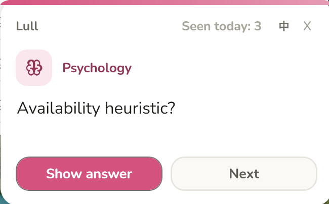
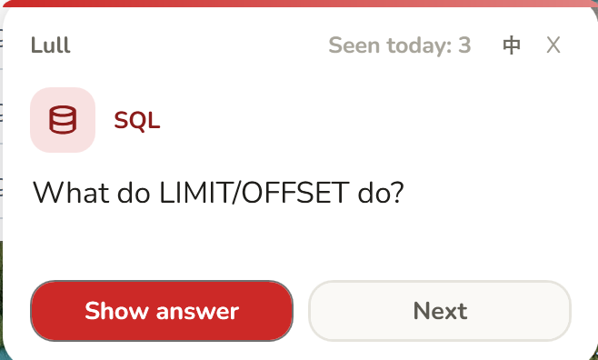
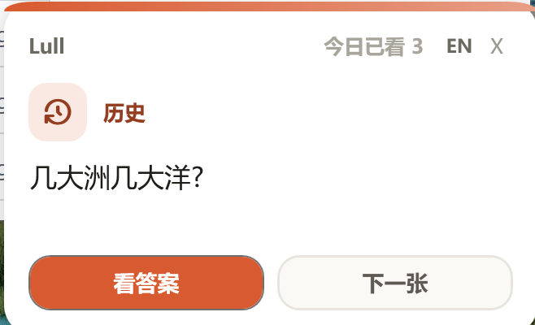
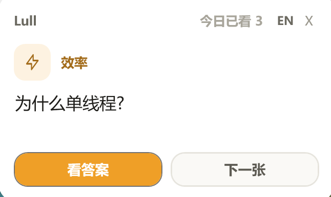

**English** | [中文](README.zh.md)

# Lull

Turn the wait while your AI coding agent thinks into one quick, glanceable flashcard.

<p align="center">
  
  
  <br>
  
  
</p>

Instead of reflex-checking your phone during the 10–60s spinner, you review one
active-recall card — relevant to what you're building — and watch a small daily
streak add up. The card pops at your screen corner the moment the agent starts
working, and gets out of your way when it's done.

> **Status:** works on Windows (Claude Code CLI / the Desktop "Code" tab).
> The free core is open source; an optional Pro add-on generates a card from your
> actual task.

---

## What you get

- A small card appears at your screen corner the moment the agent starts working.
- Flip through as many cards as you like while you wait — answers reveal on click.
- Cards come from a local deck library, ordered by your current tech stack.
- A daily "seen today" count, so the time compounds into something.
- One-click **EN / 中文** toggle on the card.
- **Pro:** an AI card generated from your *actual* prompt/files slides in (uses your own LLM key).

## Requirements

- [Node.js](https://nodejs.org)
- One of these agents (others work too — see the table below):
  - **Claude Code** — the CLI or the Desktop "Code" tab
  - **Codex CLI**
- **Windows** — the overlay uses built-in PowerShell + WPF, so there's nothing to download.
  (macOS/Linux: the hook installs fine, but the visual overlay is Windows-only for now.)

## Install (one click)

1. Download this repo (green **Code → Download ZIP**, or `git clone`) and unzip somewhere permanent.
2. **Windows:** double-click **`install.bat`**.  **macOS/Linux:** `sh install.sh`.
3. Done. Use your agent as usual — send a real coding task and a card appears at the corner.

The installer **auto-detects your agents** and wires the same hook into each one it
finds, keeping your existing settings (safe to re-run):

| Agent | Auto-pop? | What the installer does |
|---|:---:|---|
| **Claude Code** (CLI / Code tab) | ✅ | adds the hook to `~/.claude/settings.json` |
| **Codex CLI** | ✅ | adds the hook to `~/.codex/hooks.json` |
| Cursor / Gemini CLI / Goose / others | soon | not auto yet — use the standalone overlay (below) |

> Installed a new agent later? Just **re-run `install.bat`** and it wires that one too.
> It also creates a default `~/.lull/config.json` (your language, categories, and — for Pro — your key/license).

> **Any other agent, right now:** double-click `overlay/start-overlay.bat` to run the card
> as a standalone corner window and flip through it during any wait.

> Want to see the card right now, without sending a prompt? Double-click
> `overlay/start-overlay.bat`.

## How it works

1. You send a substantive task to Claude Code.
2. A flashcard pops at the bottom-right — **question first**. Take a beat to recall.
3. Click **Show answer** / **Next** to flip through while the agent works.
4. *(Pro)* A purple **✨** card generated for your specific task slides to the front.
5. Greetings and one-line messages are skipped automatically.

## Free vs Pro

|                                                   | Free (open source) | Pro |
|---------------------------------------------------|:---:|:---:|
| Corner overlay, flip-through, daily streak        | ✓ | ✓ |
| 17 built-in decks (dev + life), category & language choice | ✓ | ✓ |
| **AI card generated from your current task**      | — | ✓ |
| Premium / expert deck packs                       | — | ✓ |

Pro is an offline license key plus a small `pro/` module you drop in. It calls
**your own** DeepSeek/Claude API key — there's no middle server, and your code
only ever goes to the LLM you choose.

## Categories & language

Edit `~/.lull/config.json`:

- `enabledCategories` — any of: `writing`, `productivity`, `excel`, `money`,
  `health`, `psychology`, `science`, `history`, `english`, `tech-basics`, `dev`.
  `dev` expands to react / typescript / python / node / git / css / sql.
- `lang` — `"en"` or `"zh"` (or just click the **EN / 中** button on the card).

## Repo structure

```
install.bat · install.sh · install.js   one-click installer (registers the hook)
overlay/
  overlay.ps1            the corner card (PowerShell + WPF, zero downloads)
  start-overlay.bat      launch / preview manually
  fonts/                 bundled Nunito (the rounded card font)
plugins/lull/
  hooks/on-prompt.js     UserPromptSubmit hook: picks cards, launches overlay, (Pro) kicks off the AI card
  scripts/               pickQueue · refresh-queue · license · deckLoader · stackDetect · scheduler · store
  decks/en/  decks/zh/   bilingual deck library (17 decks each)
  skills/lull/           skill + default config (fallback for Cowork/web)
pro/                     AI module — proprietary, sold separately (not in the public repo)
```

## Develop

```bash
node plugins/lull/test/spike.js     # core-logic regression tests
```

## License

Core: **MIT**. The `pro/` module and premium decks are proprietary.
